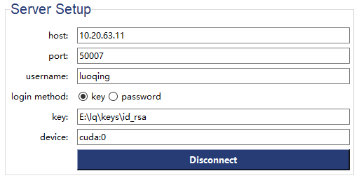
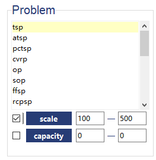
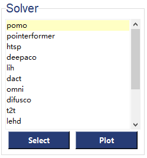
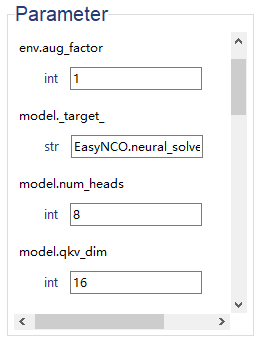
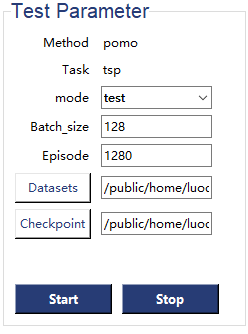
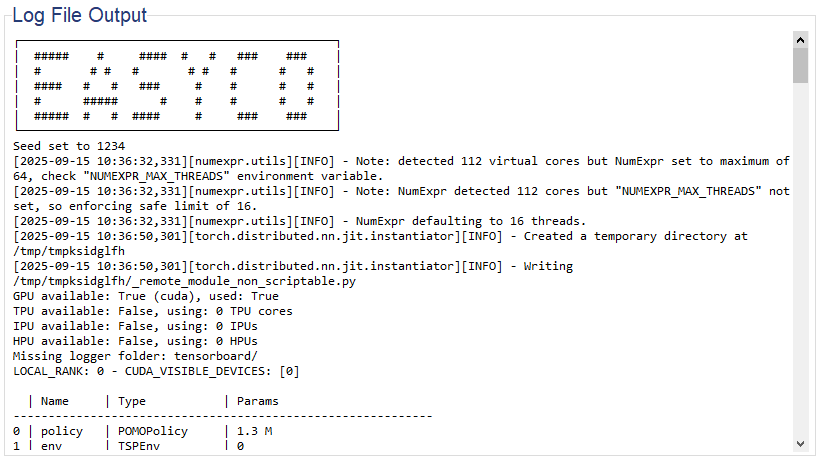
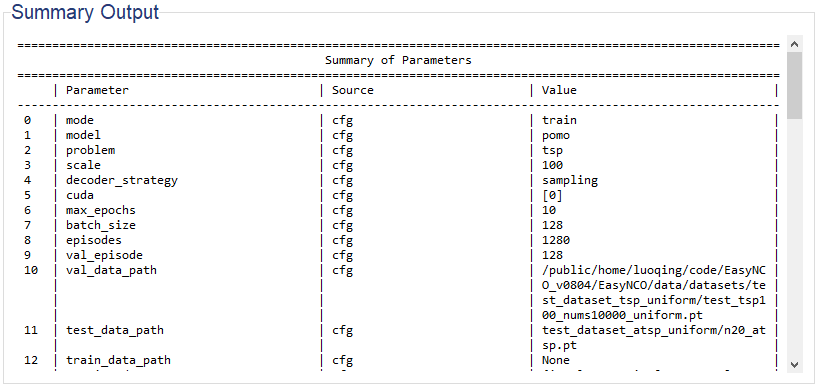
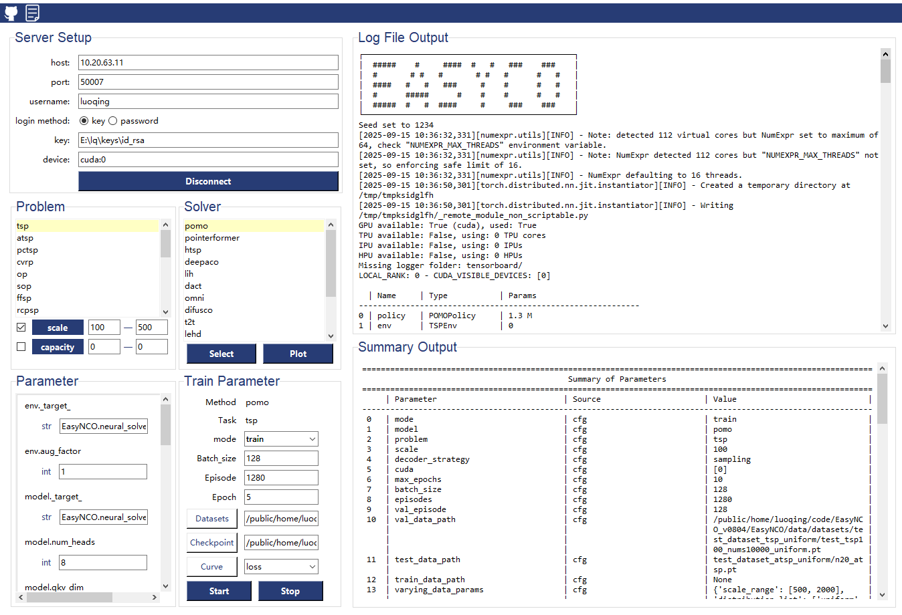

Graphical User Interface (GUI)
================================

>Welcome to the GUI. This interface is designed to provide you with a convenient and straightforward user experience. Simply configure your user information and parameters within the GUI, and it will return the results for you. Please see the user manual below for detailed instructions.

## Main Component
> To run the GUI correctly, you must place the `EasyCO` project folder in the proper directory on your remote server. Then, execute the GUI's Python script `run_gui_test.py` on your local machine (an operating system that can render a graphical interface, typically Windows).

- **Menu Bar**

    **[`github`](https://github.com/changliang5811/EasyNCO)**: Redirects to the `EasyCO` GitHub repository.
    **`documention`**:  Redirects to the `EasyCO` documentation page for user guides and references.

- **Server Setup**

* `host`: The server’s IP address or domain name to connect to.
* `port`: The specific port number through which the connection is established.
 * `username`: The user identity for logging into the server.
 * `login method`: The authentication method, either key-based or password-based.
 * `key`: The path to the private key file used for secure login (only if key-based method is chosen).
 * `device`: The target computation device on the server (e.g., CPU, GPU such as cuda:0).
 * `connect`: The button to initiate the connection to the server with the provided settings

- **Problem**

  * `Problem`: click the problem you want to solve in the `Scroll Bar` Frame.
  * `scale`: If you tick the box on the left, it means you enable the *vary scale* function. Enter the range correctly(min-max).  In this case, a dataset containing multiple scales will be provided to the solver, and the solver will filter out the instances within the specified range and solve them.
  * `capacity`:  If you check the box on the left, it enables the *vary capacity* function. Enter the range correctly(min-max). different capacity values will be provided to the solver, and the solver will select the instances satisfiy the specified range and solve them.

- **Solver**
> 💡**Tips**:  To ensure `Solver` are displayed properly, please select `Problem` first.

  * `Solver`: Click the solver you want to apply for the problem in the `Scroll Bar` Frame. Please select `problem` before you select `solver`. 
  * `Save`: Click `Save` button to view historical test results. A pop-up will appear where you can select the results you wish to visualize. The system will automatically create a local backup of the log files (located in the `GUI/log_temp/` directory) for your convenience.  
    insert picture here: tick the left frame that you want.
  * `Plot`: Click `Plot` button to see the visualized results.
    insert picture here: In the `Select Metric` dropdown, you can choose the metric you want to visualize:`Score`, `Augmented Score`, `Gap`, or `Augmented Gap`. You can also customize the plotting parameters in the `Plot Parameters` sidebar. 

- **Parameter**
> 💡**Tips**:  Please select `Problem` and `Solver` first to display the correct `Parameter`.

* `Parameter`:  The `settings` for specific `Solver` would be shown in this frame, at least you choose `Problem` and `Solver` properly.
    insert picture here: you can modified settings_parameters for `Solver` directly in GUI. 

- **Test Parameter**
> 💡**Tips**:  Please select `Problem` and `Solver` first to display the correct `Method` and `Task`.

* `Method`: Your selection of `Method` would be displayed here. 
* `Task`: Your selection of `Task` would be displayed here.
* `mode`: This is a dropdown menu to select the mode. The options are `Test` and `Training`, with `Test` being the default setting.
* `Batch_size`: The number of instances in a batch.
* `Episode`: The total number instances in an epsiode.
* `Decoder_Strategy`: The Decoder Strategy, which includes Greedy Search and Sampling, determines how the next token is selected from the decoder's output probability distribution to construct the final sequence, balancing between precision and diversity.
* `Datasets`: Click the `Dataset` button, select a file in the pop-up window, and the file's location will be displayed in the entry field. When conducting a `vary-scale` test, you can select an entire folder instead of a single file.
* `Checkpoint`: Click the `Checkpoint` button, select a file in the pop-up window, and the file's location will be displayed in the entry field.
* `Start`: Click the `Start` button to start the process.
* `Stop`: Click the `Stop` button to stop the process. > 💡**Tips**: Please click `Stop` button to terminate the last `Start` and reset settings before initiating the next `Start`.
*  `Epoch`(only for training): The number of epoch for training process.
* `Curve`(only for training): Click the `Checkpoint` button, you can trace training process in visualized results.  There are three options available in the drop-down box: `loss score`, `score` and `eval_score`.

- **Log File Output**

During the `Test` and `Training` processes, the terminal logs will be synchronously updated in the "Log File Output" area, facilitating process tracking.

- **Summary Output**

> 💡**Tips**:  Detailed parameter information will be displayed in the `Summary Output` section, where you can verify whether your parameters are set correctly.

| Source | Description |
| :--- | :--- |
| `cfg` | You can refer to the parameter in `configs.yaml`. |
| `settings` | You can refer to the parameter in `xxx_settins.yaml`. |

## Instructions for Quick Start

[1] Connect the remote Server first. When a successful connection to the remote server is established, you can view the prompt message in the `Log File Output` section.
[2] Choose the `Problem` you want to solve in `Problem` section. tick the box when you want select `vary-scale` or `vary-capacity` function. (💡 left: min value, right: max value)
[3] Choose the `Solver` you want to apply in `Solver` section. 
[4] You can customize parameter settings in the "Parameter" section; alternatively, you can leave the default settings intact without making any adjustments.
[5] modify `Test Parameter` or `Training Parameter` carefully. make sure the location of `datasets` and `checkpoint` is correct.
[6] click `start` button to start process.
[7] clicl `stop` process to terminate process.