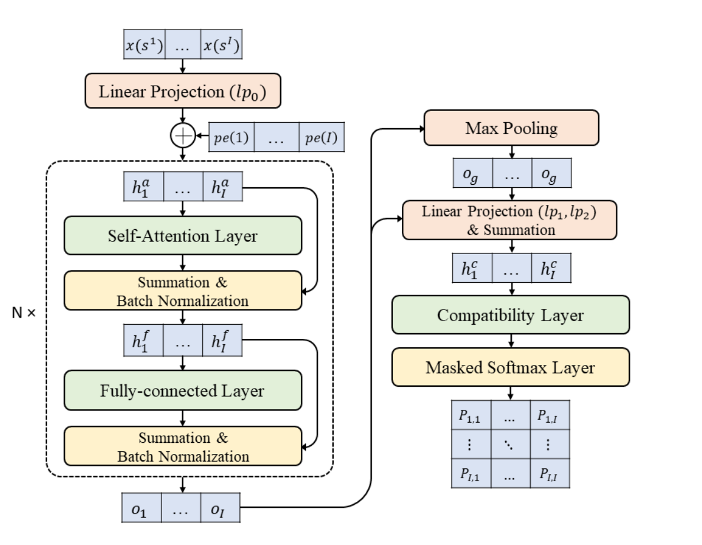

# LIH

LIH is a combinatorial optimization framework that combines deep reinforcement learning with a self-attention-based architecture, leveraging learned improvement heuristics 
and policy network-guided local search to derive high-quality solutions for routing problems. 




## `LIHInitialization`

**Bases:** `Initialization`

**Methods:**
`Initialization_tool`
* The Initialization_tool is used to generate initial solutions and calculate the length of these solutions. 
For the TSP (Traveling Salesman Problem), initial solutions are generated via the random initial method; 
for the CVRP (Capacitated Vehicle Routing Problem), initial solutions are generated using the nearest insertion method.


## `LIHIteration`

**Bases:** `Iteration`

**Methods:**
+ `2-opt`: It improves the solution with the `2-opt` operator under given iterations.

## `LIHPolicy`
+ `class LIHPolicy`:
```python
    def __init__(
        self,
        env_name: str = "tsp",  
        embed_dim: int = 128,
        init_embedding: nn.Module = None,
        num_heads: int = 1,
        qkv_dim: int = 128,
        num_encoder_layers: int = 3,
        normalization: str = "batch", 
        feedforward_hidden: int = 512,
        **kwargs
    )
```

## `LIHModel`
LIH is based on the Transformer architecture. In the encoder, it employs single-head attention, while in the decoder, full-graph maxpooling is added as supplementary information.


## Usage
You can run the following command lines to execute the code.

```bash
python train.py settings=lih_settings mode=train problem={problem} settings.module.T={T} settings.module.n_step_return={n_step_return}
python train.py settings=lih_settings mode=train problem=tsp
python train.py settings=lih_settings mode=train problem=tsp settings.module.T=200 settings.module.n_step_return=4
```


| problem | scale |  T  | n_step_return |
|:-----:|:-----:|:---:|:-------------:|
| tsp |  20   | 200 |       4       |
|     |  50   | 200 |       4       |
|     |  100  | 200 |       4       |
| cvrp |  20   | 360 |      10       |
|      |  50   | 480 |      12       |
|      |  100  | 480 |      12       |


### Tasks

Supported Tasks: TSP, CVRP

Required Data Generator:
+ [`TSPGenerator`](../developer_doc/data.md#tsp)
+ [`CVRPGenerator`](../developer_doc/data.md#cvrp)

## Policy
**main loop**

+ LIH starts by randomly generating an initial solution. The neural network then selects a pair of nodes for the 2-opt operation to improve the solution iteratively.

+ In the CVRP problem, each node is represented by a 7-dimensional vector, formed by concatenating the previous node $x_{t-1}$, the current node $x_t$, the next node $x_{t+1}$, and the demand.


## Training

LIH applies autoregressive reinforcement learning [`class ARREINFORCELightning()`](../developer_doc/phases.md#autoregressive) for training.

**training paradigm**

+ TSP is trained using the A2C algorithm.  
+ CVRP is trained using the PPO algorithm
+ Both of the training processes apply multi-step discounted rewards to improve stability and learning efficiency.