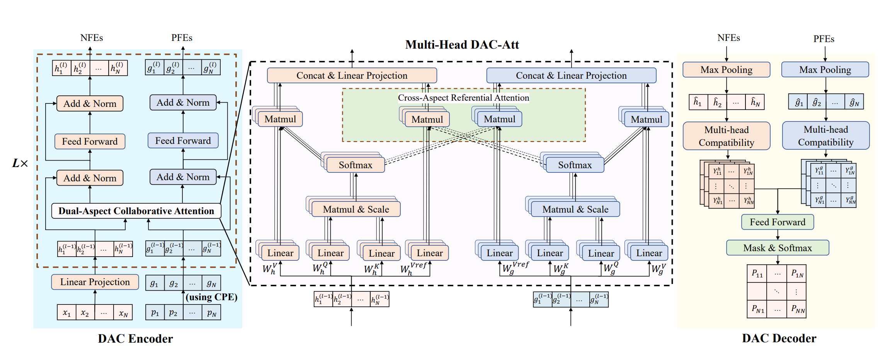

# DACT

DACT (Dual-Aspect Collaborative Transformer) improves VRP-solving performance by avoiding the noise caused by traditional position encoding (PE). It separates node feature embedding (NFE) and positional feature embedding (PFE), and uses cyclic positional encoding (CPE) based on circular Gray codes to capture the symmetry in VRP solutions. A curriculum learning strategy further improves the efficiency of reinforcement learning.




## `DACTInitialization`

**Bases:** `Initialization`

**Methods:**
`Initialization_tool`
* The Initialization_tool is used to generate initial solutions and calculate the length of these solutions. 
 It randomly generated initial solutions for training and 
the solutions generated by the greedy algorithm for inference.

## `DACTIteration`

**Bases:** `Iteration`

**Methods:**
+ `2-opt`: It improves the solution with the `2-opt` operator under given iterations.

## `DACTPolicy`
+ `class DACTPolicy`
```python
    def __init__(self,
                 env_name: str = "tsp",
                 embed_dim: int = 64,
                 feedforward_hidden: int = 64,
                 qkv_dim: int = 16,
                 num_heads: int = 4,
                 num_encoder_layers: int = 3,
                 normalization: str = "layer",
                 logit_clipping: float = 6.0,
                 **kwargs
                 ):
```

## `DACTModel`
Encoder: the encoder consists of 3 stacked DAC encoder blocks.

* `Node Feature Embeddings` (NFEs): Linear projection of node features (e.g., TSP coordinates, CVRP demand) to 64-dim vectors .
* `Positional Feature Embeddings` (PFEs): Initialized via Cyclic Positional Encoding (CPE) (based on cyclic Gray codes) to capture VRP solution circularity, outputting 64-dim vectors .
* `Dual-Aspect Collaborative Attention` (DAC-Att):
1. Computes self-attention for NFEs and PFEs independently using separate Q/K projection matrices.
2. Applies cross-aspect referential attention: NFEs reference PFEs’ attention weights and vice versa, then concatenates results .
3. Uses multi-head attention (4 heads) to aggregate outputs into enhanced NFEs/PFEs .

* `Feed-Forward Network` (FFN):
Independent FFNs (1 hidden layer, 64 units, ReLU) refine NFEs and PFEs separately. Each sub-layer includes skip connections and layer normalization .

Decoder: the decoder generates node-pair action distributions for VRP solution improvement, with 3 sub-layers.

* `Max-Pooling`:Aggregates global features for NFEs/PFEs to capture global solution context.
* `Multi-Head Compatibility`:Computes N×N compatibility matrices (action proposals) for node pairs from NFEs and PFEs independently.
* `Feed-Forward Aggregation`: Fuses 8 proposals (4 from each aspect) via a 4-layer FFN.
Applies entropy control and masks infeasible pairs, then normalizes via Softmax to get final action distributions. 

## Usage
You can run the following command lines to execute the code.


```bash
python eval.py settings=dact_settings mode=test problem={problem} settings.module.T={T}
python eval.py settings=dact_settings mode=test problem=tsp
python eval.py settings=dact_settings mode=test problem=cvrp settings.module.T={1000}
```

## Tasks

Supported Tasks: TSP, CVRP

Required Data Generator:
+ [`TSPGenerator`](../developer_doc/data.md#tsp)
+ [`CVRPGenerator`](../developer_doc/data.md#cvrp)


## Policy
**main loop**

+ Initialization: DACT randomly generated initial solutions for training and the solutions generated by the greedy algorithm for inference.
 In the greedy phase, each solution starts from the depot and builds a path by repeatedly selecting the nearest unvisited node to the current location at each step.

+ iteration: The neural network selects a pair of nodes for the 2-opt operation to improve the solution iteratively.
+ In the CVRP problem, each node is represented by a 7-dimensional vector, formed by concatenating the previous node $x_{t-1}$, the current node $x_t$, the next node $x_{t+1}$, and the demand.

## Training

DACT applies autoregressive reinforcement learning [`class ARREINFORCELightning()`](../developer_doc/phases.md#autoregressive) for training.

