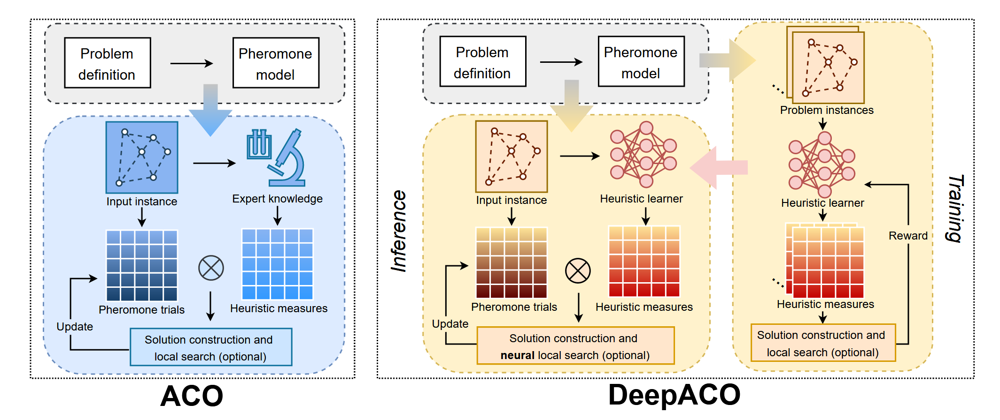

# DeepACO

DeepACO is a general combinatorial optimization framework that combines graph neural networks with ant colony optimization, using learned heuristics and neural-guided local search to find high-quality solutions.



## `DeepACOInitialization`

**Bases:** `Initialization`

**Methods:**

+ In training mode, the ACO policy is executed to collect rewards and probabilities. 
+ In evaluation mode, multiple searches are performed based on the heuristic heatmap to output the solution scores.


## `DeepACOIteration`

**Bases:** `Iteration`

**Methods:**

+ The ACO algorithm itself is an iterative algorithm, and when an ant constructs a feasible path based on heuristic measures, it corresponds to generating an initial solution.


### `ACO_{problem}`

```python
class ACO_{problem}(
  distances,
  n_ants,
  decay,
  alpha,
  beta,
  elitist,
  min_max,
  pheromone,
  heuristic,
  min,
  )
```

**Parameters**
+ `n_ants`(`int`): The number of ants used to construct solutions in each iteration.
+ `decay`(`float`): The evaporation rate of pheromones in each iteration.
+ `alpha`(`int`): Determines how much ants rely on pheromone concentration.
+ `beta`(`int`): Determines how much ants rely on heuristic information.
+ `elitist`(`bool`): Indicates whether to use the elitist strategy, i.e., whether the best path receives additional pheromone reinforcement.
+ `min_max`(`bool`): Indicates whether to use the Min-Max ACO strategy, which imposes upper and lower bounds on pheromone concentration.
+ `min`(`float`): Sets the minimum allowable pheromone value in the Min-Max ACO strategy.

**Additional parameters**
+ `two_opt`(`bool`): for tsp
+ `local_search`(`str`): for tsp
+ `k_sparse`(`int`): for tsp, pctsp
+ `adaptive`(`bool`): for cvrp
+ `swapstar`(`bool`): for cvrp

Supported *ACO* algorithms:
  + `class ACO_TSP()`
  + `class ACO_CVRP()`
  + `class ACO_OP()`
  + `class ACO_PCTSP()`
  + `class ACO_SOP()`
  + `class ACO_SMTWTP()`
  + `class ACO_RCPSP()`
  + `class ACO_MKP()`
  + `class ACO_BPP()`

### `load_policy`

The `load_policy` is used to load the corresponding ACO algorithm based on different problems.

```python
def load_policy(
  model,
  data,
  policy_param,
  env_name
  ) -> class aco
```
**Parameters:**

## Model
DeepACO predicts the *heuristic information* of ACO using [GNN](../developer_doc/methods.md#gnn). In particular, [Transformer](../developer_doc/methods.md#transformer) has also been used in MKP.

```python
class Net(
  feats=1, 
  edge_feats=1, 
  update_x=True, 
  phe_net=False
)
```
+ `EmbNet()`: update node and edge features to obtain edge embeddings.
+ `ParNet()`: inherit from MLP to predict heuristic information.


## Usage
You can run the following command lines to execute the code.

```bash
python train.py settings=deepaco_settings mode=train problem={problem} settings.model.feats={feats} settings.model.edge_feats={edge_feats} settings.model.phe_net={phe_net} settings.model.update_x={update_x}
python train.py settings=deepaco_settings mode=train problem=tsp
python train.py settings=deepaco_settings mode=train problem=op settings.model.feats=2 settings.model.phe_net=True
```

| problem | feats | edge_feats | phe_net | update_x |
|:-----:|:-----:|:------:|:------:|:-----:|
| tsp | 1(default) | 1(default) | False(default) | True(default) |
| cvrp |  |  |  |  |
| op | 2 |  | True |  |
| pctsp | 2 |  | True |  |
| sop |  |  | True | False |
| smtwtp | 2 |  | True | False |
| rcpsp | 5 | 2 |  |  |
| mkp | 5 |  | True |  |
| bpp |  |  |  |  |


## Tasks

Supported Tasks: **TSP**, **CVRP**, **OP**, **PCTSP**, **SOP**, **SMTWTP**, **RCPSP**, **MKP**, **BPP**.

Required Data Generator:
+ [`TSPGenerator`](../developer_doc/data.md#tsp)
+ [`CVRPGenerator`](../developer_doc/data.md#cvrp)
+ [`OPGenerator`](../developer_doc/data.md#op)
+ [`PCTSPGenerator`](../developer_doc/data.md#pctsp)
+ [`SOPGenerator`](../developer_doc/data.md#sop)
+ [`SMTWTPGenerator`](../developer_doc/data.md#smtwtp)
+ [`RCPSPGenerator`](../developer_doc/data.md#rcpsp)
+ [`MKPGenerator`](../developer_doc/data.md#mkp)
+ [`BPPGenerator`](../developer_doc/data.md#bpp)
