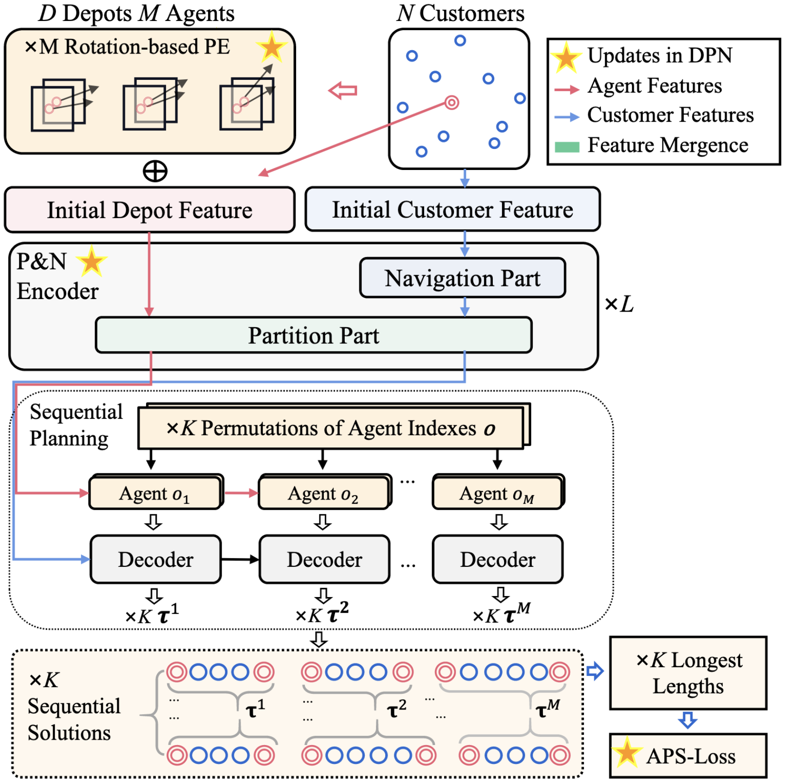

# DPN
DPN: decoupling partition and navigation for neural solvers of min-max vehicle routing problems, http://arxiv.org/abs/2405.17272, 2024 ICML

DPN is a neural solver for min-max vehicle routing problems that decouples partition and navigation tasks using a specialized attention-based encoder and leverages agent-permutation symmetry to enhance solution quality.


## `DPNInitialization`

**Bases:** `ARInitialization`

**Methods:**

+ In training mode, the policy is executed to collect rewards and likelihoods.
+ In evaluation mode, the policy is executed to collect rewards and calculate scores.


## `NoIteration`

**Bases:** `Iteration`


## `DPNPolicy`

The `DPNPolicy` class implements the neural network policy for DPN. It follows a standard encoder-decoder architecture.

**Methods:**

+ `pre_forward(td)`: This method is called once before the decoding (rollout) process begins. It computes the embeddings for the entire problem instance using the encoder and passes them to the decoder to be used during the decoding steps.
+ `forward(td)`: This method is called at each step of the decoding process. It takes the current state `td` and uses the decoder to select the next action, returning the selected action and its probability.
+ `set_decoder_strategy(strategy)`: Sets the decoding strategy, such as "sampling" or "greedy".

## `DPNEncoder`

The `DPNEncoder` is responsible for generating rich, contextual embeddings for the problem entities (nodes, agents, and depots). It employs a sophisticated architecture that separates the logic for different problem types to handle their unique characteristics.

+ **Problem-Specific Architectures:** The encoder uses distinct sub-modules for different problems, implementing the "Partition and Navigation" attention mechanism described in the DPN paper:
  + `Partition_Navigation_Encoder_TSP`: For `mTSP`.
  + `Partition_Navigation_Encoder_PDP`: For `mPDP`.
  + `Partition_Navigation_Encoder_MDVRRP`: For `MDVRP` and `FMDVRP`.
+ **Initial Embeddings:** It begins by projecting the initial 2D coordinates of nodes, agents, and depots into a higher-dimensional space.
+ **Rotary Positional Encoding (`RotatePostionalEncoding`):** It uses rotary positional embeddings (RoPE) to inject relative positional information into the attention mechanism, which is more effective for routing problems than standard sinusoidal encodings.

## `DPNDecoder`

The `DPNDecoder` autoregressively constructs the solution by selecting the next node for each agent at each step. It uses an attention-based mechanism to decide which node to visit next.

+ **Attention-Based Selection:** It uses a multi-head attention mechanism to compute a probability distribution over all possible next nodes. The query is constructed from the current step's context, and the keys and values are derived from the encoder's output embeddings.
+ **Dynamic Context:** At each decoding step, it generates a `step_context` that includes information about the current agent, its current location, the number of remaining agents to dispatch, and the number of unvisited nodes. This context is crucial for making informed decisions.
+ **Precomputation and Caching:** To improve efficiency, the decoder precomputes and caches fixed components of the attention mechanism (keys, values, and projections) in the `set_fixed` method before the decoding process starts.
+ **Complex Masking:** The `get_mask` method implements problem-specific logic to ensure solution feasibility. It masks out invalid actions, such as visiting an already visited node or returning to the depot prematurely.

## Usage
You can run the following command lines to execute the code.

```bash
python train.py/eval.py settings=dpn_settings mode={train/test} problem={mtsp/mpdp/mdvrp/fmdvrp} scale={problem size} decoder_strategy={sampling/greedy} settings.env.agent_min={agent_min} settings.env.agent_max={agent_max} settings.env.depot_min={depot_min} settings.env.depot_max={depot_max}
```

**Note:** For the setting in mTSP and mPDP, the `scale` parameter includes the single depot. For MDVRP and FMDVRP, the `scale` includes all depots.

For more details, the training settings are listed in the tables below. (original paper table5)
| Problem | mPDP50 & mTSP50 | mPDP100 & mTSP100 |
| :--- | :--- | :--- |
| **Fintune or not** | No | No |
| **number of agents($M$)** | [2,10] | [2,10] |
| **number of depots($D$)** | 1 | 1 |
| **number of encoder layers (L)** | 6 | 6 |
| **learning rate** | 1.00E-04 | 1.00E-04 |
| **learning rate decay**| 1 | 1 |
| **batch size** | 256 | 256 |
| **epoch size** | 500 | 500 |
| **epochs** | 256000 | 256000 |
| **number of permutations ($K$)** | 60 | 60 |

| Problem | mPDP200 & mTSP200 | mPDP500 & mTSP500 |
| :--- | :--- | :--- |
| **Fintune or not** | From 100 | From 100 |
| **number of agents($M$)** | [10,20] | [30,50] |
| **number of depots($D$)** | 1 | 1 |
| **number of encoder layers (L)** | 6 | 6 |
| **learning rate** | 1.00E-05 | 1.00E-05 |
| **learning rate decay**| 1 | 1 |
| **batch size** | 64 | 16 |
| **epoch size** | 20 | 20 |
| **epochs** | 64000 | 16000 |
| **number of permutations ($K$)** | 60 | 60 |

| Problem | MDVRP50 & FMDVRP50 | MDVRP100 & FMDVRP100 |
| :--- | :--- | :--- |
| **Fintune or not** | No | No |
| **number of agents($M$)** | [2,10] | [2,10] |
| **number of depots($D$)** | [2,10] | [2,10] |
| **number of encoder layers (L)** | 6 | 6 |
| **learning rate** | 1.00E-04 | 1.00E-04 |
| **learning rate decay**| 1 | 1 |
| **batch size** | 256 | 256 |
| **epoch size** | 500 | 500 |
| **epochs** | 256000 | 256000 |
| **number of permutations ($K$)** | 60 | 60 |

| Problem | MDVRP50-F & FMDVRP50-F | MDVRP100-F & FMDVRP100-F |
| :--- | :--- | :--- |
| **Fintune or not** | From 50 | From 100 |
| **number of agents($M$)** | [3,7] | [5,10] |
| **number of depots($D$)** | 8 | 8 |
| **number of encoder layers (L)** | 6 | 6 |
| **learning rate** | 1.00E-05 | 1.00E-05 |
| **learning rate decay**| 1 | 1 |
| **batch size** | 128 | 128 |
| **epoch size** | 20 | 20 |
| **epochs** | 128000 | 128000 |
| **number of permutations ($K$)** | 60 | 60 |

## Tasks

Supported Tasks: min-max mTSP, min-max mPDP, MDVRP, FMDVRP.

Required Data Generator:
+ [`TSPGenerator`](../developer_doc/data.md#tsp)

## Training

DPN applies autoregressive reinforcement learning [`class ARREINFORCENARLightning()`](../developer_doc/phases.md#autoregressive) for training.