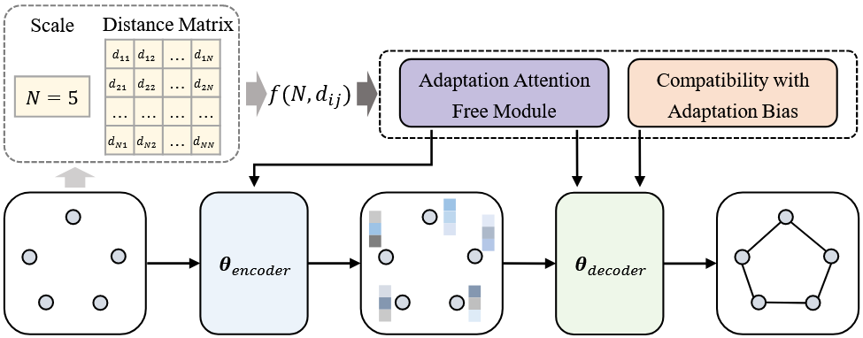

# ICAM

ICAM is a reinforcement learning-based neural combinatorial optimization model that utilizes instance-conditioned adaptation and a multi-stage training scheme to achieve efficient large-scale generalization for routing problems such as TSP and CVRP.


## `ICAMInitialization`

**Bases:** `ARInitialization`

**Methods:**

+ In training mode, the policy is executed to collect rewards and likelihoods.
+ In evaluation mode, the policy is executed to collect rewards and calculate scores.


## `NoIteration`

**Bases:** `Iteration`


## `ICAMPolicy`

The `ICAMPolicy` class implements the neural network policy for ICAM. It follows a standard encoder-decoder architecture. It contains two main problem-specific policies: `TSPICAMPolicy` and `CVRPICAMPolicy`.

**Methods:**

+ `pre_forward(td)`: This method is called once before the decoding (rollout) process begins. It calculates the distance matrix and log scale, encodes the input data using the corresponding encoder, and sets the key and value for the decoder's attention mechanism.
+ `forward(td)`: This method is called at each step of the decoding process. It takes the current state `td` and uses the decoder to select the next action, returning the selected action and its probability.
+ `set_decoder_strategy(strategy)`: Sets the decoding strategy, such as "sampling" or "greedy".

## `ICAMEncoder`

The `ICAMEncoder` is responsible for generating contextual embeddings for the problem entities. It has specialized implementations for TSP and CVRP.

+ **Problem-Specific Encoders:**
  + `TSPICAMEncoder`: Embeds the 2D coordinates of the nodes.
  + `CVRPICAMEncoder`: Embeds the depot and customer nodes separately, considering customer demands.
+ **Encoder Layer:** Both encoders consist of multiple `EncoderLayer`s. Each `EncoderLayer` contains:
    + An `adaptation_attention_free_module` which is the core of the ICAM model, replacing standard multi-head attention. It incorporates distance information directly into the attention mechanism.
    + A feed-forward network.
    + Layer normalization.
+ **Adaptation Attention Free Module (`adaptation_attention_free_module`):** This module is inspired by the "Attention Free Transformer". It computes a weighted sum of values, where the weights are determined by the queries, keys, and an adaptive bias term derived from the distance matrix. This allows the model to adapt to the instance-specific geometry.

## `ICAMDecoder`

The `ICAMDecoder` autoregressively constructs the solution by selecting the next node at each step. It uses the `adaptation_attention_free_module` to decide which node to visit next. It has specialized implementations for TSP and CVRP.

+ **Attention-Based Selection:** Instead of a standard multi-head attention mechanism, it uses an `adaptation_attention_free_module` (AAFM). The query is constructed from the current step's context (e.g., last visited node, vehicle load). The keys and values are derived from the encoder's output embeddings.
+ **Dynamic Context:**
    + For `TSPICAMDecoder`, the query is a combination of the embeddings of the first and last nodes.
    + For `CVRPICAMDecoder`, the query incorporates the last node's embedding and the current vehicle load.
+ **Precomputation and Caching:** To improve efficiency, the decoder precomputes and caches keys and values from the encoder's output using the `set_kv` method. It also caches query components (`set_q1`, `set_q2`).
+ **Probability Calculation:** The final probability distribution over the next nodes is computed via a single-head attention mechanism on the AAFM output, which is then scaled and biased by the distance to other nodes, clipped, and masked to ensure feasibility.

## Usage
You can run the following command lines to execute the code.

```bash
python train.py/eval.py settings=udc_settings mode={train/test} problem={tsp/cvrp} scale={problem size} decoder_strategy={sampling/greedy}
```

## Tasks

Supported Tasks: TSP, CVRP.

Required Data Generator:
+ [`TSPGenerator`](../developer_doc/data.md#tsp)
+ [`CVRPGenerator`](../developer_doc/data.md#cvrp)