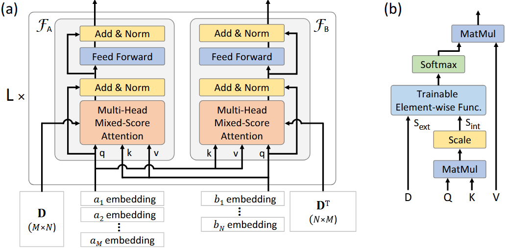

# MatNet
Matrix Encoding Networks for Neural Combinatorial Optimization, https://proceedings.neurips.cc/paper/2021/hash/29539ed932d32f1c56324cded92c07c2-Abstract.html, 2021 NIPS

MatNet is a neural matrix encoding network that processes bipartite graph-structured data with a dual attention mechanism to solve asymmetric combinatorial optimization problems like ATSP and FFSP through end-to-end reinforcement learning.


## `MatNetInitialization`

**Bases:** `ARInitialization`

**Methods:**

+ In training mode, the policy is executed to collect rewards and likelihoods.
+ In evaluation mode, the policy is executed to collect rewards and calculate scores.


## `NoIteration`

**Bases:** `Iteration`


## `MatNetPolicy`

The `MatNetPolicy` class is a factory that provides the appropriate policy network for a given problem, either `ATSPPolicy` or `FFSPPolicy`. These policies follow a standard encoder-decoder architecture.

**Methods:**

+ `pre_forward(td)`: This method is called once before the decoding process begins. It initializes row and column embeddings (using one-hot encoding for columns) and then uses the `MatNetEncoder` to generate contextual embeddings for the rows and columns of the cost matrix. It then caches the key and value matrices in the decoder for efficient attention computation.
+ `forward(td)`: This method is called at each step of the decoding process. It takes the current state `td`, generates a query from the current context (e.g., the last selected node), and uses the decoder to compute a probability distribution over the next possible actions.
+ `set_decoder_strategy(strategy)`: Sets the decoding strategy, such as "sampling" or "greedy".

## `MatNetEncoder`

The `MatNetEncoder` is responsible for generating contextual embeddings for the row and column entities of the input cost matrix. It consists of multiple `EncoderLayer`s that iteratively refine these embeddings.

+ **Dual Encoding Blocks:** Each `EncoderLayer` contains two `EncodingBlock`s, one for updating the row embeddings and one for updating the column embeddings. This dual structure allows the model to capture the bipartite nature of the problem.
+ **Mixed-Score Multi-Head Attention:** The core of the `EncodingBlock` is the `MixedScore_MultiHeadAttention`. This mechanism computes attention scores by combining two sources of information:
    1.  The standard dot-product attention between queries and keys.
    2.  The raw cost matrix values.
    These two scores are mixed using a small neural network, allowing the model to learn the optimal way to combine semantic similarity and cost information.
+ **Iterative Refinement:** The embeddings are passed through a series of `EncoderLayer`s, allowing for deep, iterative refinement of the row and column representations. Each layer's output becomes the input for the next, enabling the model to build increasingly sophisticated contextual understanding.

## `MatNetDecoder`

The `MatNetDecoder` autoregressively constructs the solution by selecting the next item at each step. It has specialized implementations for ATSP (`ATSPDecoder`) and FFSP (`FFSPDecoder`).

+ **Attention-Based Selection:** It uses a standard multi-head attention mechanism to compute a probability distribution over all possible next items. The query is constructed from the current step's context, and the keys and values are derived from the encoder's output embeddings.
+ **Dynamic Context:**
    + For `ATSPDecoder`, the query is a combination of the embeddings of the first and current nodes.
    + For `FFSPDecoder`, the query is the embedding of the current machine. It also includes a special "NO_JOB" embedding to allow machines to remain idle.
+ **Precomputation and Caching:** To improve efficiency, the decoder precomputes and caches the key and value matrices from the encoder's output using the `set_kv` method. It also caches the query component from the first node in ATSP (`set_q1`).
+ **Probability Calculation:** The final probability distribution is obtained by a single-head attention mechanism over the output of the multi-head attention, followed by scaling, clipping, masking for feasibility, and a softmax operation.


## Usage
You can run the following command lines to execute the code.

```bash
python train.py/eval.py settings=matnet_settings mode={train/test} problem={atsp/ffsp} scale={problem size} decoder_strategy={sampling/greedy} settings.model.num_encoder_layers={5/3} settings.env.pomo_size=24
```

## Tasks

Supported Tasks: ATSP, FFSP.

Required Data Generator:
+ [`ATSPGenerator`](../developer_doc/data.md#atsp)
+ [`FFSPGenerator`](../developer_doc/data.md#ffsp)