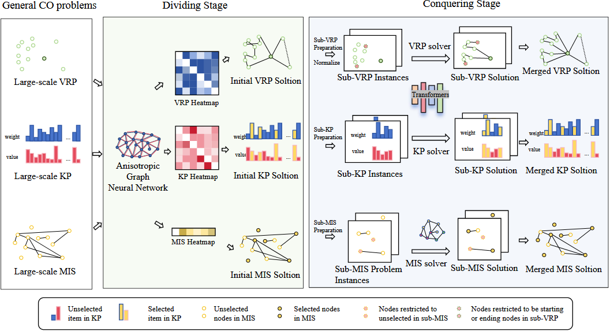

# UDC

UDC is a unified neural divide-and-conquer framework that employs a graph neural network for global partitioning and a fixed-length sub-solver with a novel Divide-Conquer-Reunion training scheme to solve large-scale combinatorial optimization problems efficiently and generally.


## `UDCInitialization`

**Bases:** `Initialization`

The `UDCInitialization` class handles the initial phase of the UDC framework, which involves generating a global tour using a GNN-based partitioning model.

**Methods:**

+ `run(env, batch, strategy, phase, **kwargs)`: This is the main entry point. It orchestrates the initialization process based on the current phase (train or eval) and problem type (TSP or CVRP).
+ `_run_train_tsp(env, strategy, **kwargs)` / `_run_train_cvrp(env, batch, strategy, **kwargs)`: In training mode, these methods generate an initial solution (a permutation of nodes) using the partitioning model (`model_p`). The model autoregressively selects nodes based on a heatmap generated by the GNN, and the log-probabilities of these selections are saved for later use in the loss calculation.
+ `_run_eval_tsp(env, batch, strategy, **kwargs)` / `_run_eval_cvrp(env, batch, strategy, **kwargs)`: In evaluation mode, these methods generate solutions for the test instances using the trained partitioning model. They follow a similar autoregressive selection process but typically use a deterministic strategy (e.g., argmax) instead of sampling.
+ `_gen_pyg_data(data, env_name, k_sparse)`: A helper function to convert the problem data into the PyTorch Geometric `Data` format required by the GNN partitioning model.


## `UDCIteration`

**Bases:** `Iteration`

The `UDCIteration` class implements the "Reunion" stage of the UDC framework. It takes the globally ordered tour from `UDCInitialization` and iteratively improves it by resolving small subproblems using a Transformer-based solver (`model_t`).

**Methods:**

+ `run(...)`: The main method that dispatches to the appropriate training or evaluation function based on the phase and environment.
+ `_run_train_tsp(...)` / `_run_train_cvrp(...)`: During training, these methods perform the Divide-Conquer-Reunion process. They take the initial solution, break it into subproblems, solve each subproblem with the Transformer model (`model_t`), and then merge the results. The loss for the partitioning model (`model_p`) is calculated here using the final tour quality as the reward signal and the log-probabilities from the initialization phase.
+ `_run_eval_tsp(...)` / `_run_eval_cvrp(...)`: During evaluation, these methods iteratively apply the subproblem solver to refine the initial solution for a fixed number of steps or until convergence. They track the best score found.
+ `_tsp_eval_one_batch(...)` / `_cvrp_test_one_batch(...)`: These are the core implementation functions for the iterative refinement process during evaluation. They handle the logic of extracting subproblems from the current global tour, normalizing them, solving them with the Transformer model, and integrating the improved sub-tours back into the global solution. They also handle data augmentation.
+ `play_episode(...)`: A helper function to run the Transformer-based policy (`model_t`) on a batch of subproblems.


## `UDCPolicy`

The `UDCPolicy` class encapsulates the two main components of the UDC framework: a partitioning model (`model_p`) and a Transformer-based subproblem solver (`model_t`).

+ **`model_p` (`glop_partition_net`)**: This is a Graph Neural Network responsible for the initial "Divide" phase. It takes the entire problem instance and produces a heatmap, which is then used to guide an autoregressive process to generate a globally ordered tour.
+ **`model_t` (`TSPModel` or `CVRPModel`)**: This is the "Conquer" part of the framework, a Transformer-based model (specifically, a modified `ICAM` model) designed to solve small, fixed-size subproblems extracted from the global tour. It has its own encoder-decoder structure.

**`TSPModel` / `CVRPModel` Methods:**

+ `pre_forward(td)`: This method is called once before the decoding process for a batch of subproblems. It encodes the subproblem instances using a modified `ICAMEncoder` and sets up the key-value cache in the decoder.
+ `forward(td)`: This method is called at each step of the decoding process within a subproblem. It uses a modified `ICAMDecoder` to select the next node in the sub-tour.
+ `set_decoder_strategy(strategy)`: Sets the decoding strategy for the subproblem solver, such as "sampling" or "greedy".

The key idea is that `model_p` provides a good initial global ordering, and `model_t` iteratively refines this ordering by optimally solving small local segments of the tour.


## Usage
You can run the following command lines to execute the code.

```bash
python train.py/eval.py settings=udc_settings mode={train/test} problem={tsp/cvrp} scale={problem size} decoder_strategy={sampling/greedy} settings.model.feats={2/3} settings.module.max_steps=n
```

## Tasks

Supported Tasks: TSP, CVRP.

Required Data Generator:
+ [`TSPGenerator`](../developer_doc/data.md#tsp)
+ [`CVRPGenerator`](../developer_doc/data.md#cvrp)